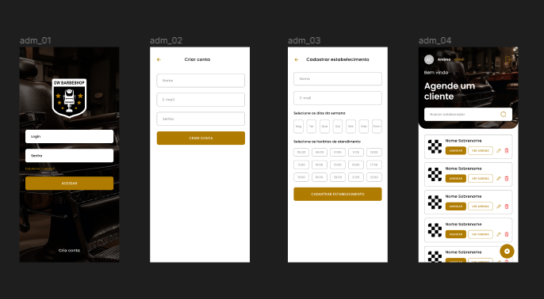
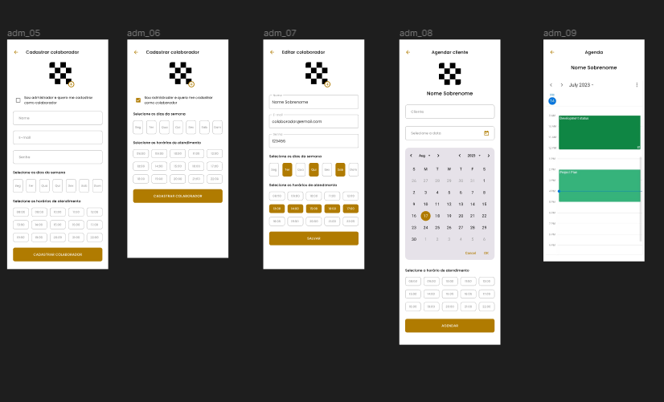
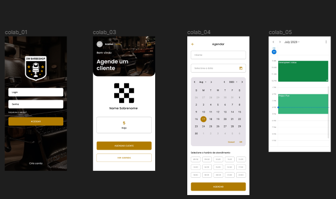

# Dart Week agosto/2023 BarberShop - Flutter/Riverpod

## Descrição do Projeto

Este repositório contém o código-fonte de um aplicativo DW BARBERSHOP desenvolvido durante a Dart Week 2023 11º edição pelo processsor Rodrigo Rahman. O objetivo do projeto é criar um aplicativo para Barbearia com recursos de Cadastros de Administrador, Empregados e agendamento de horários, proporcionando uma maneira conveniente para os clientes agendarem seus cortes de cabelo.

## Architecture and dependencies
Este projeto foi construído com arquitetura MVVM (Model-View-ViewModel)

Uso do package Riverpod, que é Uma biblioteca de gerenciamento de estado

## Screens

## Visão do Administrador

<div align="center" style="display: flex; flex-direction: row; flex-wrap: wrap; justify-content: center; align-items: center; align-content: center; gap: 10px;">
    
    

</div>

## Visão do Colaborador

<div align="center" style="display: flex; flex-direction: row; flex-wrap: wrap; justify-content: center; align-items: center; align-content: center; gap: 10px;">
    

</div>

## Como rodar a aplicação

### Pré-requisitos

- [Dart](https://dart.dev/get-dart)
- [Flutter](https://flutter.dev/docs/get-started/install)
- [Android Studio](https://developer.android.com/studio)
- [VSCode](https://code.visualstudio.com/)
- [Git](https://git-scm.com/)

### Backend
- [Instruções para o Backend](https://gist.github.com/rodrigorahman/22a7d055bded90c6d9bdedb594d2b8fb)


### Rodando a aplicação

```bash
# Clone este repositório
$ git clone https://github.com/gilvancosta/dw_barbershop_2023.git

# Acesse a pasta do projeto no terminal/cmd
$ cd dw_barbershop_2023

# Instale as dependências
$ flutter pub get

# Execute a aplicação em modo de desenvolvimento
$ flutter run
```

### Tecnologias utilizadas:

- Dart
- Flutter

## Referências:
- [Canal YouTube - Rodrigo Rahman ](https://www.youtube.com/@rodrigorahman)


## Licença

Este projeto esta sobe a licença MIT. Consulte a [LICENÇA](LICENSE.txt) para saber mais.